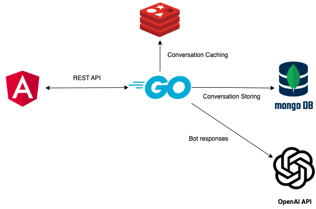

# CHATBOT STORE

Chatbot store project that uses OpenAI API to generate bot messages

### Env variables

- create a file containers/.container.env in which set values from .dev.container.env
- create .env file in which set values from .dev.env

### how to run locally

```
go get
make run-db-containers
make run
```

### Project Architecture

<p align="center">
  
</p>
